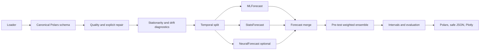

# Research and architecture decision record

## Executive decision

The package uses a small orchestration layer around three Nixtla backends:
MLForecast for tabular regressors, StatsForecast for statistical benchmarks, and
optional NeuralForecast for LSTM. The public API remains functional and compact,
while the internal registry separates fast defaults from expensive experiments.

## Evidence behind the choices

1. **Rolling origins must match deployment.** Forecasting: Principles and
   Practice describes time-series cross-validation as a rolling forecast origin
   where no future observation constructs a forecast. Its multi-step extension
   motivates measuring every required horizon rather than optimizing only one-step
   residuals. MLForecast exposes the same `h`, `step_size`, `refit`, and
   `input_size` concepts. [Hyndman and Athanasopoulos](https://otexts.com/fpp3/tscv.html),
   [MLForecast cross-validation](https://nixtlaverse.nixtla.io/mlforecast/forecast.html)

2. **Ordinary random K-fold is not the production test.** Bergmeir, Hyndman, and
   Koo show when K-fold can be valid for autoregression with uncorrelated errors;
   that condition does not justify shuffling a drifting winter-to-summer load
   series. Chronological rolling origins remain the conservative default here.
   [Paper](https://robjhyndman.com/publications/cv-time-series/)

3. **Temperature, calendar, and probabilistic forecasts matter for load.** The
   GEFCom2014 literature uses temperature-based load models and explicitly models
   uncertainty. Hong and Fan emphasize reproducible probabilistic evaluation,
   not point accuracy alone. [GEFCom method](https://doi.org/10.1016/j.ijforecast.2015.11.010),
   [tutorial review](https://doi.org/10.1016/j.ijforecast.2015.11.011)

4. **A hard benchmark is mandatory.** Nixtla's electricity-load example compares
   a multi-seasonal model with SeasonalNaive. This package always makes
   SeasonalNaive available and adds AutoARIMA as a widely used automatic benchmark.
   [StatsForecast electricity-load example](https://nixtlaverse.nixtla.io/statsforecast/docs/tutorials/electricityloadforecasting.html),
   [automatic forecasting](https://nixtlaverse.nixtla.io/statsforecast/docs/how-to-guides/automatic_forecasting.html)

5. **Future exogenous semantics must be explicit.** Nixtla distinguishes historic
   variables from values available over the complete forecast horizon. Weather
   realization is not a fair operational covariate unless it is replaced by the
   forecast vintage available at that origin. [StatsForecast exogenous guide](https://nixtlaverse.nixtla.io/statsforecast/docs/how-to-guides/exogenous.html),
   [NeuralForecast exogenous guide](https://nixtlaverse.nixtla.io/neuralforecast/docs/capabilities/exogenous_variables.html)

6. **Recursive and direct forecasts solve different cost/accuracy problems.** A
   recursive model is cheap but propagates its predictions. Direct forecasting
   trains a model per step and can reduce propagation error at higher cost.
   MLForecast supports both, so `strategy` is an explicit configuration.
   [Nixtla direct forecasting guide](https://nixtlaverse.nixtla.io/mlforecast/docs/how-to-guides/one_model_per_horizon.html)

7. **Intervals are horizon-aware.** MLForecast's conformal calibration uses rolling
   windows and adjusts width by horizon. Coverage is still measured out of sample;
   a requested 95% label is not accepted as proof of 95% empirical coverage.
   [Nixtla prediction intervals](https://nixtlaverse.nixtla.io/mlforecast/docs/how-to-guides/prediction_intervals.html)

## Dataset diagnosis

The electric-boiler file contains 6,731 observations from 2024-12-12 through
2025-09-24 and six outages totalling 134 missing hourly targets. It covers less
than one full year, so it cannot demonstrate year-over-year seasonal robustness.
The loader repairs the known outages from the same hour one week earlier and marks
those rows with `y_imputed`; it never silently forward-fills the target.

On the complete raw series:

| Diagnostic | Result | Interpretation |
|---|---:|---|
| ADF p-value | 0.223 | unit root not rejected |
| KPSS p-value | <0.01 | stationarity rejected |
| ACF lag 24 | 0.958 | very strong daily persistence |
| ACF lag 168 | 0.868 | strong weekly persistence |
| corr(load, mean temperature) | -0.880 | temperature is essential |
| early/late KS statistic | 0.848 | severe chronological regime shift |

First and 24-hour differences pass both stationarity tests, so the diagnostic
`auto` policy proposes seasonal differencing. Rolling validation rejected that
proposal: raw-level LinearRegression reached 0.562 MAE, versus 0.594 after first
differencing and 0.658 after seasonal differencing. The production default is
therefore `none`; `auto` remains an explicit experiment rather than a blind rule.

## Validation under winter/summer shift

The package recommends sliding-window candidates when both a significance test and
a standardized effect-size threshold indicate drift. It does not automatically
declare that two weeks is enough training. For hourly demand, two weeks contains
only two weekly cycles and is usually a high-variance fit.

Recommended evaluation layers:

1. Final untouched test period at the actual horizon and stride.
2. Pre-test rolling-origin validation to select model, transform, refit cadence,
   and expanding versus 2/4/8-week sliding history.
3. A recent four-week stress test with the first two weeks for training and the
   last two for testing, reported separately rather than used as the only score.
4. Seasonal slices (cold, shoulder, warm) once at least one full annual cycle is
   available; preferably validate the same season in a later year.

## Model tiers

- Low: SeasonalNaive, LinearRegression, Ridge, Lasso, ElasticNet.
- Medium: RandomForest, ExtraTrees, GradientBoosting, HistGradientBoosting,
  LightGBM, XGBoost, KNN, MLP, AutoARIMA, ARIMAX, MSTL.
- High/opt-in: GaussianProcess (cubic fit cost), SARIMAX, and LSTM.

LSTM uses Nixtla's encoder-decoder implementation with robust scaling, a small
hidden state, early stopping, future exogenous support, and a probabilistic normal
loss. It is not a default: less than one year of one series is precisely where a
small tree or regularized linear model can outperform a neural model at a fraction
of the operational cost.

## Leakage and data-exposure controls

- Future `y` is never passed as a feature; the invariance audit scrambles it and
  requires identical predictions.
- Ensemble weights are calibrated on rolling predictions inside training history,
  never on the final test errors to which they are applied.
- MASE scaling uses training observations only.
- External JSON excludes actuals, exogenous values, learned features, and training
  rows by default. Actuals require `include_actual=True`.
- Backtest history includes only observations strictly earlier than each origin.
- Missing targets require an explicit policy and imputed rows are marked.
- Statistical/neural models cannot silently reuse stale state at a changed origin.

## Stopping rule for tuning

Residual Gaussianity is a useful diagnostic, not an accuracy objective. Load errors
often retain autocorrelation or heavy tails even when the best deployable model has
been reached. Tuning stops when repeated pre-test rolling validation produces no
material MAE/MASE improvement, interval coverage is stable, compute cost remains
acceptable, and residual autocorrelation no longer offers an actionable feature or
model change. The untouched test set is evaluated once after selection.

## Boiler benchmark result

Model and ensemble choices were selected on rolling daily origins from 2025-03-15
through 2025-04-14. The frozen evaluation covers 13 daily origins from 2025-04-15
through 2025-04-28, with a 24-hour horizon and 24-hour stride.

| Forecast | MAE | RMSE | Bias | MASE |
|---|---:|---:|---:|---:|
| Existing provided forecast | 0.238 | 0.293 | 0.151 | 0.313 |
| Pre-test weighted ensemble | 0.332 | 0.416 | 0.008 | 0.436 |
| AutoARIMA | 0.353 | 0.475 | 0.059 | 0.463 |
| Tuned Ridge | 0.354 | 0.445 | -0.103 | 0.465 |
| SARIMAX | 0.385 | 0.468 | 0.061 | 0.507 |
| SeasonalNaive | 0.432 | 0.568 | 0.079 | 0.568 |

The ensemble improves SeasonalNaive MAE by about 23% and is nearly unbiased. Its
80% and 95% split-conformal intervals covered 95.8% and 99.4% respectively, so
they are conservative on this small evaluation. Ensemble residuals pass a
Jarque–Bera normal-shape test but fail Ljung–Box independence; they are not white
noise, and further tuning should target the remaining temporal structure rather
than Gaussianity alone.

Two final leakage-free refinements confirmed the stopping point. Horizon-specific
bias correction monotonically worsened MAE from 0.3315 to 0.3455 as correction
strength increased. Horizon-specific inverse-error weights produced 0.3318–0.3326
MAE and did not remove Ljung–Box dependence. They were rejected rather than adding
complexity without a reproducible gain.

The existing `forecast` column remains the champion. Its construction and weather
vintage are unknown, so it is reported as a benchmark rather than silently used as
a feature. It should remain in production until provenance is verified and the new
pipeline wins across longer, multi-season evaluation data.

## Full-history seasonal stability result

The short April evaluation is deliberately protected from model and ensemble
selection. It answers the narrow question, "How does the frozen candidate perform
on unseen data?" A second retrospective backtest answers a different question:
"How stable would this configuration have been across the available seasons?"

After reserving 2024-12-12 through 2025-01-09 for initial fitting and leakage-free
ensemble calibration, the stability run uses every complete daily origin through
2025-09-24: 258 origins and 6,192 hourly forecasts. Frozen pre-backtest weights are
used throughout; ML coefficients are refreshed every 14 origins using the latest
672 hours.

| Month | Weighted ensemble MAE | Existing forecast MAE |
|---|---:|---:|
| 2025-01 | 0.640 | 0.541 |
| 2025-02 | 0.656 | 0.423 |
| 2025-03 | 0.639 | 0.544 |
| 2025-04 | 0.359 | 0.223 |
| 2025-05 | 0.211 | 0.173 |
| 2025-06 | 0.141 | 0.106 |
| 2025-07 | 0.079 | 0.062 |
| 2025-08 | 0.110 | 0.102 |
| 2025-09 | 0.129 | 0.084 |
| **All** | **0.323** | **0.246** |

The month-level error changes by roughly eightfold between winter and midsummer.
That is direct evidence that production acceptance should require monthly or
temperature-regime reporting in addition to one pooled score. The existing
forecast wins overall and in every month, subject to the unresolved provenance and
weather-vintage caveat above.

Run `python scripts/backtest_full_history.py` to regenerate the JSON report, safe
forecast artifact, and standalone interactive Plotly explorer in `artifacts/`.

## Residual-improvement ablation result

The structured residuals motivated four leakage-safe experiments over the same 258
daily origins. Every model refit saw only the latest observations before its
origin; adaptive methods used only errors from completed prior origins.

| Candidate | MAE | RMSE | Bias |
|---|---:|---:|---:|
| Original frozen ensemble | 0.323 | 0.509 | 0.072 |
| Seven-day adaptive ensemble weights | 0.313 | 0.493 | 0.062 |
| Recursive Ridge, 28 days, refit every 14 days | 0.332 | 0.516 | 0.031 |
| Recursive Ridge, 28 days, refit every 7 days | 0.328 | 0.513 | 0.032 |
| Recursive Ridge, 28 days, refit every 3 days | 0.306 | 0.479 | 0.035 |
| Recursive Ridge, 28 days, daily refit | 0.300 | 0.471 | 0.020 |
| **Daily Ridge plus thermal dynamics** | **0.297** | **0.468** | **0.022** |
| Direct Ridge, 28 days, refit every 14 days | 0.433 | 0.687 | -0.067 |

The winner improves MAE by 8.0% relative to the ensemble and 10.6% relative to
the original 14-day-refit Ridge. It wins in cold, transition, and warm aggregate
segments and in eight of nine calendar months; January worsens by 1.8%. Daily
refitting is the main gain, while thermal dynamics add a further 1.1% over daily
Ridge. A 14-day history reaches 0.314 MAE and a 56-day history 0.315, confirming
the 28-day window rather than a general preference for more or less history.

Residual mean improves from -0.0715 to -0.0218 and weekly residual
autocorrelation from 0.367 to 0.199. Lag-1 autocorrelation remains 0.875 and both
normal-shape and Ljung–Box tests still fail. The model is therefore more accurate
and less biased, but its residuals are not white noise. The unknown existing
forecast remains better at 0.246 MAE.

This ablation is retrospective and uses realized temperature for every candidate.
It is suitable for choosing a candidate for prospective testing, not for claiming
an unbiased production improvement. Final acceptance requires new observations
and the weather-forecast vintage that was actually available at each origin.

A requested recent-regime stress test trained on 2025-08-27 through 2025-09-10
and tested the following two weeks. Ridge reached 0.170 MAE but MASE 1.57, showing
that two weeks is not enough training history for this load. The optional Nixtla
LSTM integration also ran successfully after constraining PyTorch to one CPU thread;
a ten-step smoke fit took 3.27 seconds and reached 0.508 MAE on its first 24-hour
validation origin, so it remains opt-in.
